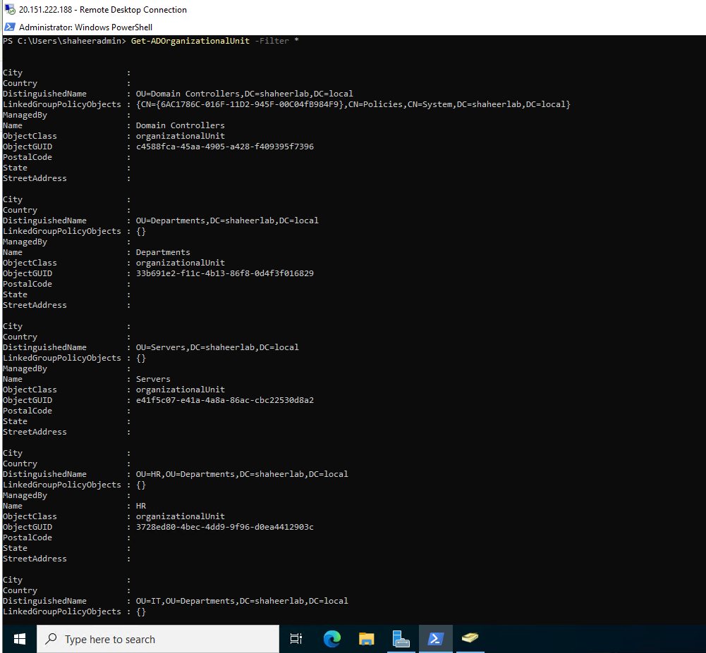
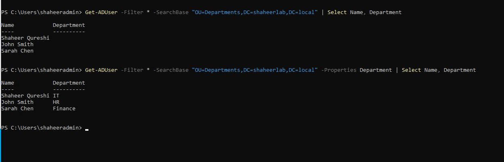
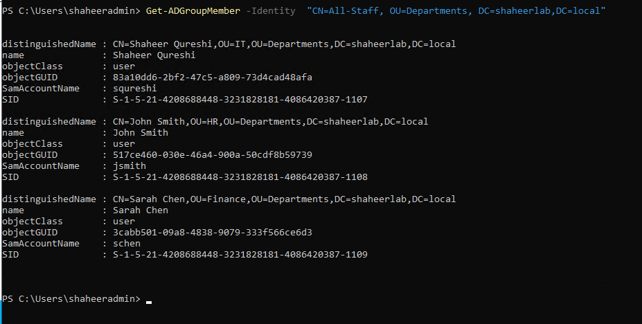
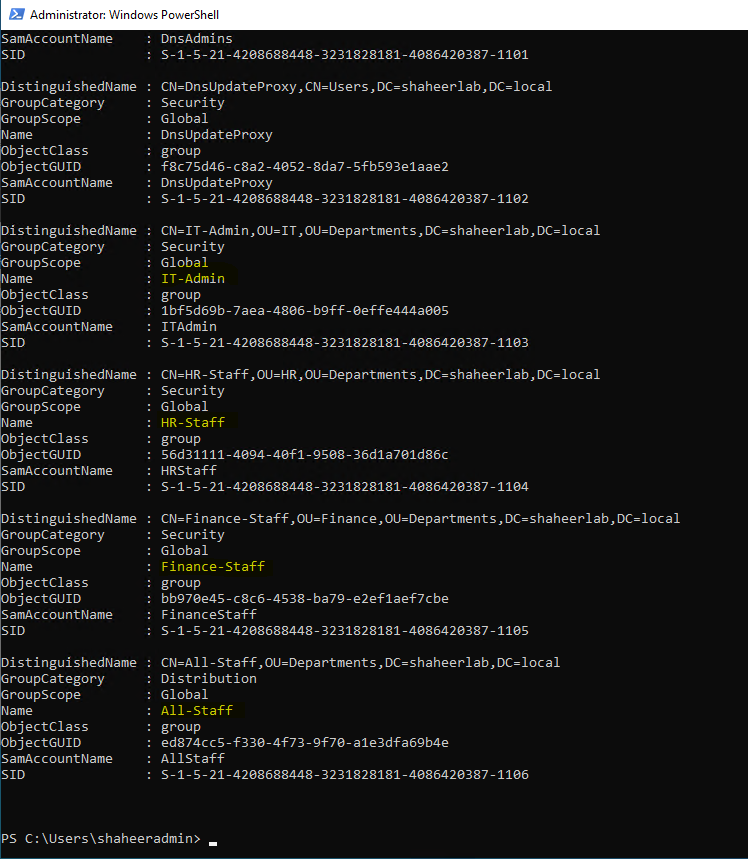
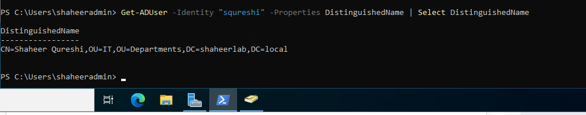

# Level 01 — Active Directory Foundations

## What I built
Built a complete Active Directory structure from scratch using 
PowerShell only — no GUI clicking. Deployed a Windows Server 2022 
domain controller on Azure via Terraform, created a domain, designed 
an OU hierarchy, provisioned users, created security and distribution 
groups, and verified everything through PowerShell.

## Infrastructure
Provisioned via Terraform — see `main.tf` for full configuration:
- Resource group: `rg-dc`
- VNet: `vnet-dc` (10.0.0.0/16)
- Subnets: `sn-dev`, `sn-prod`
- NSG with RDP rule
- Windows Server 2022 VM: `vm-dc`

## Domain
```
Forest: shaheerlab.local
Domain: shaheerlab.local
DC:     vm-dc.shaheerlab.local
```

## OU Structure
```
shaheerlab.local
├── Departments
│   ├── IT
│   ├── HR
│   └── Finance
└── Servers
```

## Users

| Name | Username | OU | Department |
|------|----------|----|------------|
| Shaheer Qureshi | squreshi | OU=IT | IT |
| John Smith | jsmith | OU=HR | HR |
| Sarah Chen | schen | OU=Finance | Finance |

## Groups

| Group | Type | Scope | Members |
|-------|------|-------|---------|
| IT-Admin | Security | Global | squreshi |
| HR-Staff | Security | Global | jsmith |
| Finance-Staff | Security | Global | schen |
| All-Staff | Distribution | Global | squreshi, jsmith, schen |

## Key PowerShell commands used

```powershell
# Install AD DS and create domain
Install-WindowsFeature -Name AD-Domain-Services -IncludeManagementTools
Install-ADDSForest -DomainName "shaheerlab.local"

# Create OU structure with loop
$Departments = "HR", "IT", "Finance"
foreach($dept in $Departments) {
    New-ADOrganizationalUnit -Name $dept -Path "OU=Departments,DC=shaheerlab,DC=local"
}

# Create user
New-ADUser -Name "Shaheer Qureshi" -SamAccountName "squreshi" `
  -Path "OU=IT,OU=Departments,DC=shaheerlab,DC=local" `
  -Department "IT" -Enabled $true

# Create security group
New-ADGroup -Name "IT-Admin" -GroupScope Global -GroupCategory Security `
  -Path "OU=IT,OU=Departments,DC=shaheerlab,DC=local"

# Add members to group
Add-ADGroupMember -Identity "CN=IT-Admin,OU=IT,OU=Departments,DC=shaheerlab,DC=local" `
  -Members "squreshi"

# Move user to correct OU
Move-ADObject -Identity "CN=Shaheer Qureshi,CN=Users,DC=shaheerlab,DC=local" `
  -TargetPath "OU=IT,OU=Departments,DC=shaheerlab,DC=local"
```

## What I learned

**Distinguished Names matter.** When objects live in specific OUs 
you can't just reference them by name — you need the full DN path. 
`CN=IT-Admin,OU=IT,OU=Departments,DC=shaheerlab,DC=local` tells AD 
exactly where to look.

**PowerShell loops save time.** Creating 3 OUs with a foreach loop 
instead of running the same command 3 times is the foundation of 
automation thinking. The same pattern scales to 300 OUs.

**User location vs group membership are different things.** A user 
lives in an OU (their location in the directory). A user is a member 
of a group (their permissions and access). These are independent — 
a user in OU=IT can be a member of HR-Staff if needed.

**The Department attribute needs to be set explicitly.** Creating a 
user with `-Department` doesn't always persist — use `Set-ADUser` 
to confirm attributes are set correctly after creation.

## Verification

OU structure:


Users with departments:


All-Staff group members:


All groups:


User in correct OU:


## Results
- ✅ Domain shaheerlab.local created
- ✅ OU hierarchy built with nested structure
- ✅ 3 users created in correct OUs with department attributes
- ✅ 3 security groups + 1 distribution group created
- ✅ Users added to correct department groups
- ✅ All 3 users in All-Staff distribution group
- ✅ All verified via PowerShell — no GUI used
